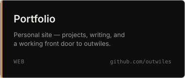
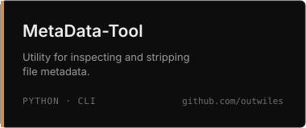
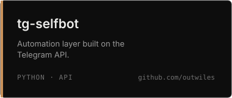
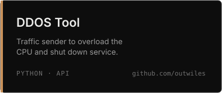

<div align="center">
  
</div>

<br/>

<table>
<tr>
<td width="150" valign="top">
  
</td>
<td valign="top">

Aashu builds small, sharp tools — the kind that solve one problem well and get out of the way.

No portfolio of buzzwords. Just things that work, and a habit of taking them apart to see why.

</td>
</tr>
</table>

<br/>

### whoami

```python
class Outwiles:
    name      = "Aashu"
    alias     = "outwiles"
    role      = "developer"
    base      = "India"
    interests = ["automation", "tooling", "reverse engineering", "APIs"]
    currently = "building, mostly at night"
```

<br/>

### what I build

**Tools** — small utilities built to remove one specific annoyance, not to be a platform.

**Automation** — scripts and bots that replace a repetitive manual task with a reliable one.

**API-driven projects** — working directly against platform APIs (Telegram and others) rather than wrapping someone else's SDK.

**Taking things apart** — reading how software actually works before deciding whether to trust it.

<br/>

### selected projects

<table>
<tr>
<td></td>
<td></td>
</tr>
<tr>
<td></td>
<td></td>
</tr>
  <tr>
<td></td>
<td></td>
</tr>
</table>

<sub>[Portfolio](https://github.com/outwiles/Portfolio) · [MetaData-Tool](https://github.com/outwiles/MetaData-Tool) · [tg-selfbot](https://github.com/outwiles/tg-selfbot) · [DDOS Tool](https://github.com/outwiles/DDOS-TOOL)</sub>

<br/>

### stack

<sub>

`Python` `JavaScript` `HTML` `CSS` `Git` `Linux`

</sub>

<br/>

### current focus

Automation that holds up outside a demo. API internals — how platforms actually behave, not just what the docs say. Making tools smaller instead of bigger.

<br/>

### status



<br/>

### contact

<p align="center">
  <b>Developed by Aashu</center><br/><br/>
  <a href="https://t.me/outwiles">
    
  </a>
  <a href="https://github.com/outwiles">
    
  </a>
  <a href="mailto:outwiles@proton.me">
    
  </a>
</p>


<br/>

<div align="center">
<sub><i>build it. break it. know why.</i></sub>
</div>
